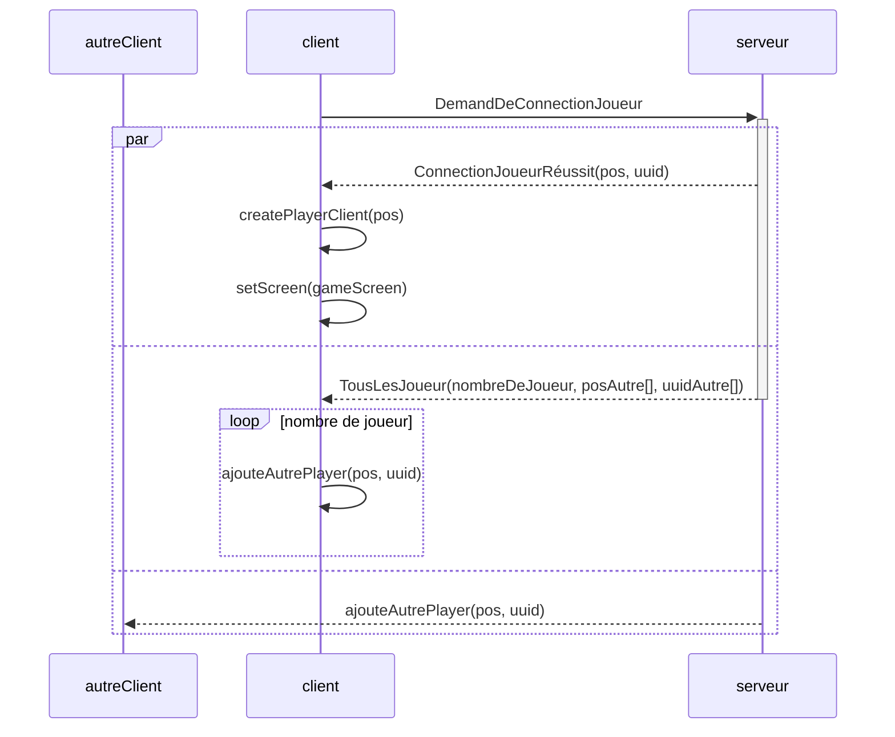

```mermaid
sequenceDiagram
    participant autreClient
    participant client
    participant serveur

    client ->>+ serveur: DemandDeConnectionJoueur
    par
        serveur -->> client: ConnectionJoueurRéussit(pos, uuid)
        client ->> client: createPlayerClient(pos)
        client ->> client: setScreen(gameScreen)
    and
        serveur -->>- client: TousLesJoueur(nombreDeJoueur, posAutre[], uuidAutre[])
        loop nombre de joueur
            client ->> client: ajouteAutrePlayer(pos, uuid)
        end
    and
        serveur -->> autreClient: ajouteAutrePlayer(pos, uuid)
    end
```