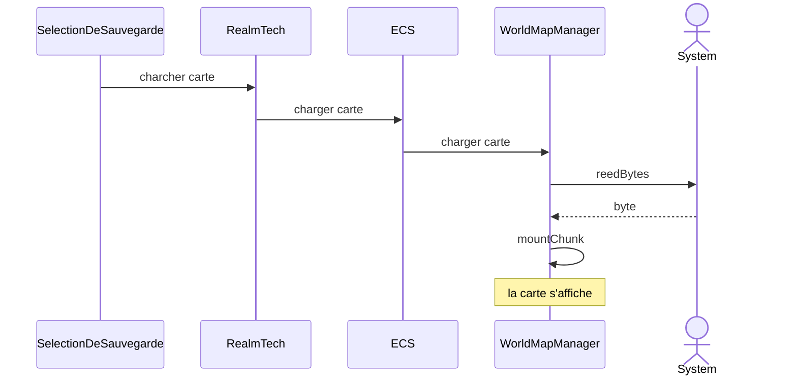

[//]: # (Sauvegarder un chunk)

[//]: # (```mermaid)

[//]: # (sequenceDiagram)

[//]: # (    actor Jeu)

[//]: # ()
[//]: # (    Jeu ->> Jeu : getAllChunks)

[//]: # (    Jeu ->> SaveInfCtrl : saveChunk)

[//]: # (    SaveInfCtrl ->> SaveInfWrk : saveChunk)

[//]: # (    Actor System)

[//]: # (    SaveInfWrk ->> System : writeFile)

[//]: # (    System -->> SaveInfWrk : writeFile)

[//]: # (    SaveInfWrk -->> SaveInfCtrl : saveChunk)

[//]: # (    SaveInfCtrl -->> Jeu : saveChunk )

[//]: # (    )
[//]: # (```)

[//]: # ()
[//]: # (Charger un chunk et le monter sur la vue)

[//]: # (```mermaid)

[//]: # (sequenceDiagram)

[//]: # (    box ECS)

[//]: # (    actor  Jeu)

[//]: # (    participant WorldMapManager)

[//]: # (    end)

[//]: # (    Jeu ->> SaveInfCtrl : loadChunk)

[//]: # (    SaveInfCtrl ->> SaveInfWrk : loadChunk)

[//]: # (    actor System)

[//]: # (    SaveInfWrk ->> System : loadChunk)

[//]: # (    System -->> SaveInfWrk : bytes)

[//]: # (    SaveInfWrk -->> SaveInfCtrl : infChunkComponent)

[//]: # (    SaveInfCtrl ->> WorldMapManager : mountChunk)

[//]: # (    note over WorldMapManager : le chunk est<br> maintenant afficher)

[//]: # (```)

Une nouvelle carte est chargée
