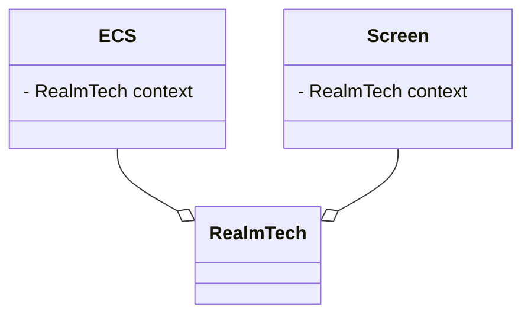

RealmTech est la classe la plus haute dans la hiérarchie.
Son rôle est de faire le lien entre les écrans et le jeu. RealmTech,
Permet de donner du context aux écrans.
Par exemple, dans l'écran de sélection de sauvegarde, l'écran
demande au context, quelque sont les sauvegardes à afficher.

Le ECS est la partie centrale du jeu. C'est lui qui contient tout
le nécessaire pour le jeu. Il est créé quand le jeu commence, quand
l'écran va sur le jeu et se termine quand le jeu est fini lorsque le 
joueur à quitter la partie. L'ECS contient : 
- le système entités composant
- le monde physique
- le joueur
- la sauvegarde