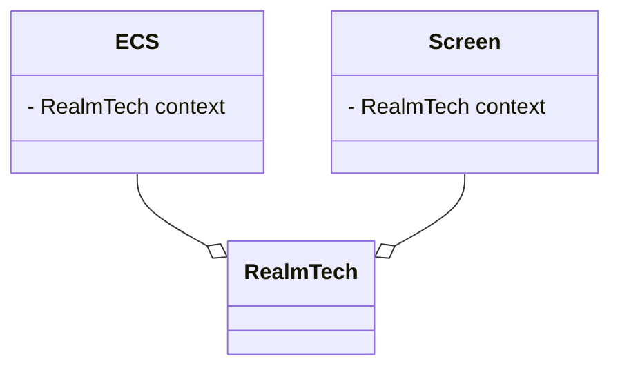
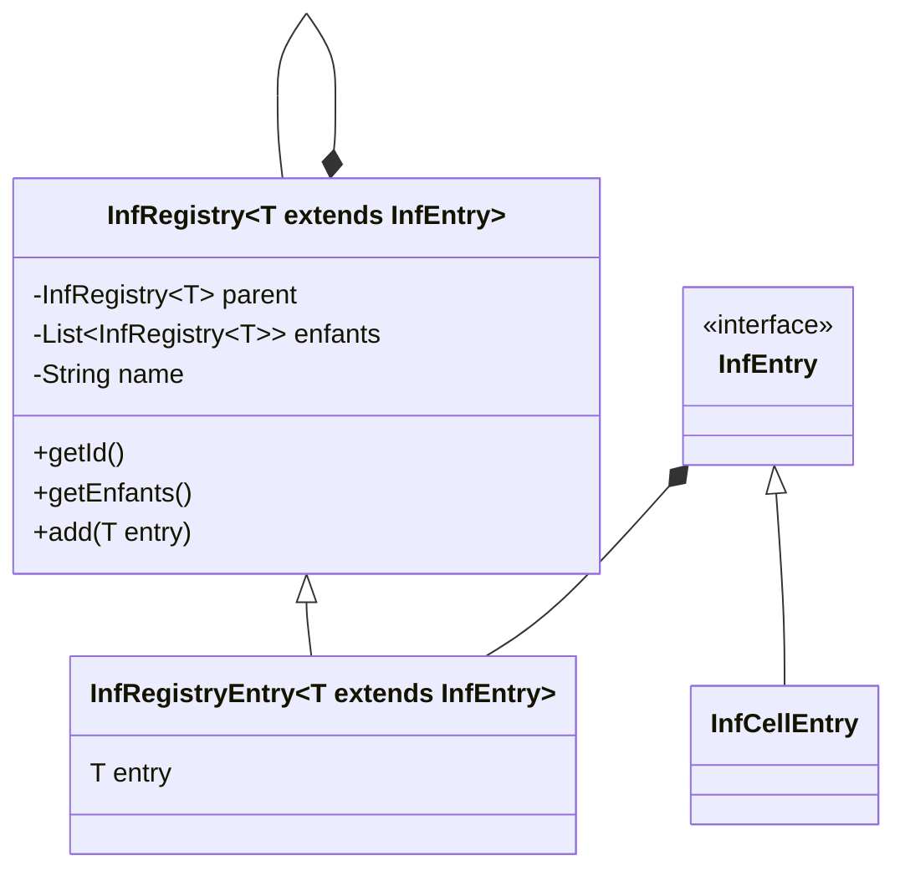

RealmTech est la classe la plus haute dans la hiérarchie.
Son rôle est de faire le lien entre les écrans et le jeu. RealmTech,
Permet de donner du context aux écrans.
Par exemple, dans l'écran de sélection de sauvegarde, l'écran
demande au context, quelque sont les sauvegardes à afficher.

Le ECS est la partie centrale du jeu. C'est lui qui contient tout
le nécessaire pour le jeu. Il est créé quand le jeu commence, quand
l'écran va sur le jeu et se termine quand le jeu est fini lorsque le 
joueur à quitter la partie. L'ECS contient : 
- le système entités composant
- le monde physique
- le joueur
- la sauvegarde

### cellules
Les cellules composent le monde. Elles sont divisées en plusieurs catégories
en fonction de leur layer. Le layer représente le niveau où la cellule
se trouve.

0. ground
1. gournd deco
2. build
3. build déco

Ce système de layer, peut varier dans les futures versions du protocole
de sauvegarde du monde, mais pour le moment, ça marche comme ça.
Le layer est sauvegardé dans le CelleBehavior.
Le layer est utilisé pour poser la cellule sur le plateau

### registre
Les registres permettent de stocker tout le contenu que jeux va utiliser.
Ainsi, il est plus facile d'ajouter du contenu.
