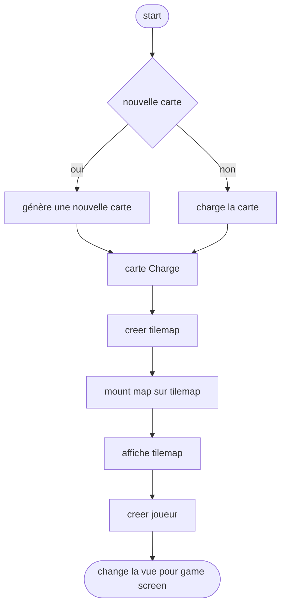
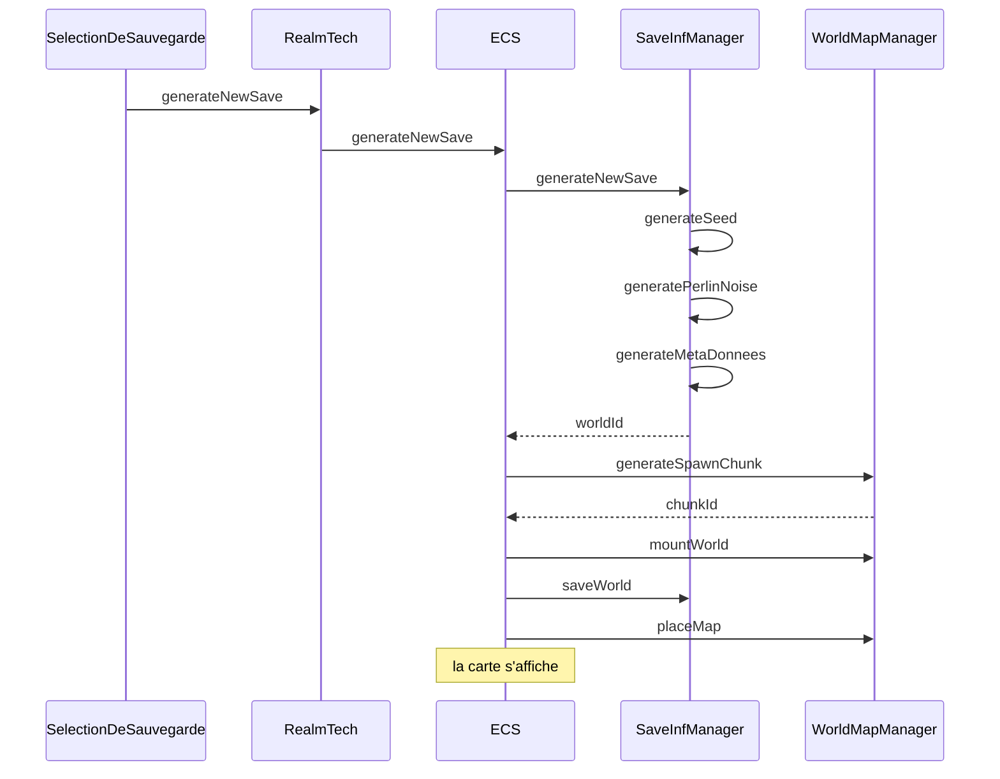

Avant de d'afficher la carte dans l'écran, il faut :

```mermaid
flowchart
    A([start]) --> B{nouvelle carte}
    B --> |oui| C[génère une nouvelle carte]
    B --> |non| D[charge la carte]
    C --> E[carte Charge]
    D --> E[carte Charge]
    E --> F[creer tilemap]
    F --> G[mount map sur tilemap]
    G --> H[affiche tilemap]
    H --> I[creer joueur]
    I --> J([change la vue pour game screen])
```

Générer une nouvelle carte

```mermaid
sequenceDiagram
    participant SelectionDeSauvegarde
    participant RealmTech
    participant ECS
    participant SaveInfManager
    participant WorldMapManager
    SelectionDeSauvegarde ->> RealmTech : generateNewSave
    RealmTech ->> ECS : generateNewSave
    ECS ->> SaveInfManager : generateNewSave
    SaveInfManager ->> SaveInfManager : generateSeed
    SaveInfManager ->> SaveInfManager : generatePerlinNoise
    SaveInfManager ->> SaveInfManager : generateMetaDonnees
    SaveInfManager -->> ECS : worldId
    ECS ->> WorldMapManager : generateSpawnChunk
    WorldMapManager -->> ECS : chunkId
    ECS ->> WorldMapManager : mountWorld
    ECS ->> SaveInfManager : saveWorld
    ECS ->> WorldMapManager : placeMap
    note over ECS : la carte s'affiche
```