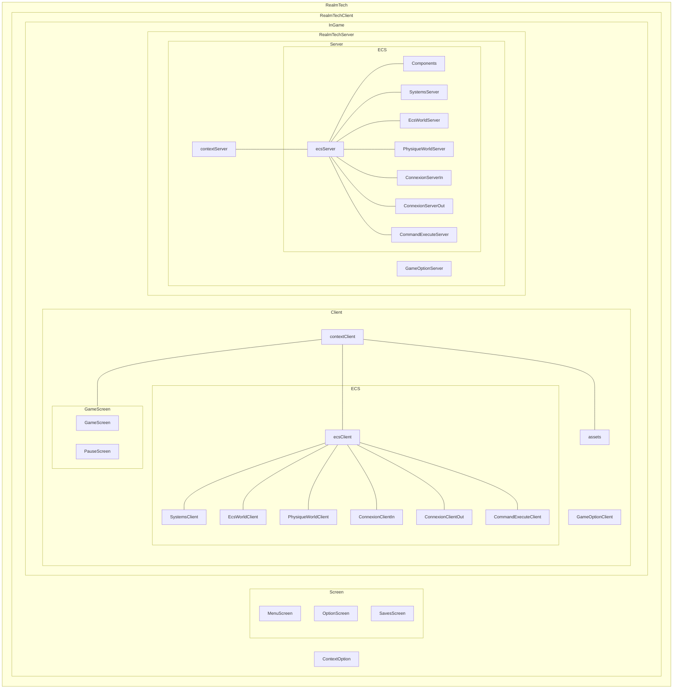
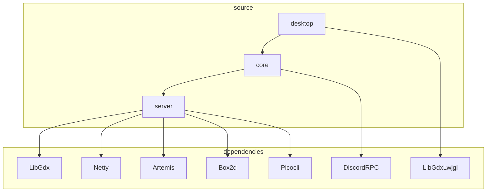
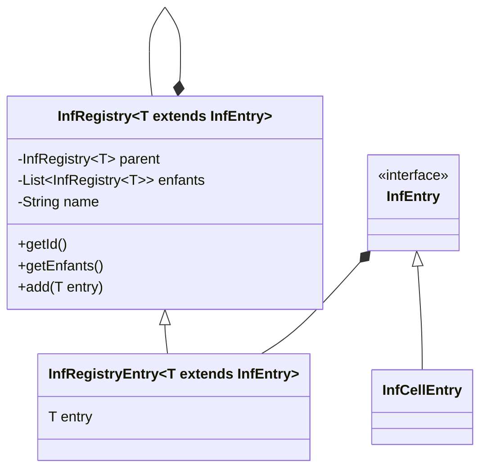
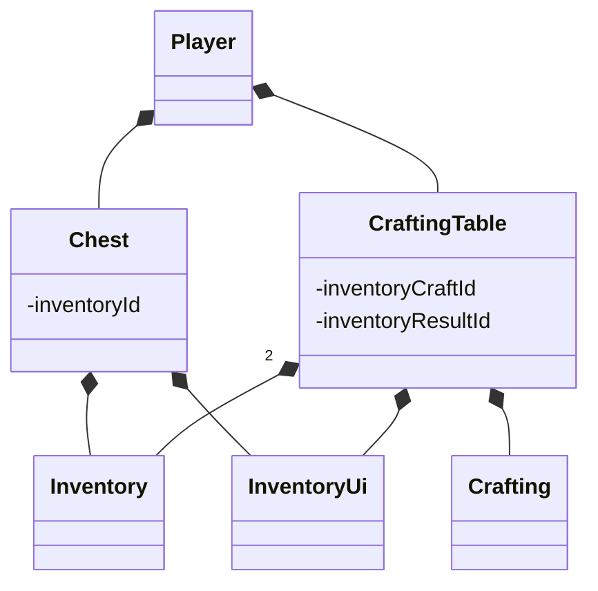

# RealmTech

## Introduction

Un petit jeu qui s'inspire de Factorio (dans la partie 2d de la carte)
et de Gregtech (pour la mécanique de progression des tier). L'un
des buts premiers RealmTech est de changer la mécanique de progression
de Factorio pour qu'elle soit moins dans la production massive
de fiole, mais dans l'évolution progressive des matériaux pour accéder
à de meilleures machines. L'un des buts est aussi de pouvoir avoir
une plus grande liberté de construction avec des blocs décoratifs
qu'on peut posse n'importe où pour créer ses propres bâtiments.

## Jouer au jeu
### cmd
```shell
git clone https://github.com/FabienChatton/RealmTech
cd RealmTech
.\gradlew desktop:run
```
Cette méthode stock le fichier RealmTechData dans le dossier assets ce
qui n'est pas le comportement attendu. Pour la meilleure configuration,
jeu vous recommande la méthode d'importation de la configuration
dans le dossier.run avec Intellij
### IntelliJ
```shell
git clone https://github.com/FabienChatton/RealmTech
```
Et importé la configuration dans le dossier .run

## Road Map

### indev

1. [x] sauvegarder carte générée
2. [x] carte générée procéduralement
3. [x] texture joueur animé
4. [x] inventaire joueur
5. [x] outils
6. [x] récupérer resources avec outils
7. [x] system de craft
8. [x] generation des minerais
9. [x] machine basique

### infdev

1. [x] carte infinie
2. [ ] serveur interne
3. [ ] console de debug

### alpha

1. [ ] reorganisation du code selon architecture
2. [ ] raccourci clavier custom
3. [ ] machine multi cellules
4. [ ] infrastructure, convoyer/pipe
5. [ ] simulation physique client

### beta 

1. [ ] pétrole
2. [ ] véhicule
3. [ ] trains
4. [ ] plusieurs dimensions

## Doc Architecture
RealmTech est la globalité du projet. La partie client est
en soi, le jeu vu par le joueur. La partie serveur contient le serveur de jeu.
Pour que le jeu fonctionne, il faut la partie client et la partie serveur, mais pas d'inquiétude,
le client inclut le serveur. Le serveur peut etre utilisé de manière "Standalone", c'est-à-dire
sans le client, anssi, des clients peuvent se connecter sur une machine dédier.


Le ECS est la partie centrale du jeu. C'est lui qui contient tout
le nécessaire pour le jeu. Il est créé quand le jeu commence, quand
l'écran va sur le jeu et se termine quand le jeu est fini lorsque le
joueur à quitter la partie. L'ECS contient :
- le système entités composant
- le monde physique
- le joueur
- la sauvegarde

### organisation des projets
RealmTech est composé de 3 sous projets
- core
- server
- desktop

Le core est la partie comprenant la code pour la partie client, c'est ici
qu'on trouve tout ce qui est texture ou interface graphique.

Le server est la partie... serveur, il y a le code source du serveur et tout la partie
en commun entre le client et le serveur. C'est ce sous projet qui est le plus gros de
code source.

Le desktop ne comporte que la class main pour lancer le jeu sur pc.

Il y a le sous projet test, mais qui est utilisé que pour faire des test unitaires.




### cellules
Les cellules composent le monde. Elles sont divisées en plusieurs catégories
en fonction de leur layer. Le layer représente le niveau où la cellule
se trouve.

0. ground
1. ground deco
2. build
3. build déco

Ce système de layer, peut varier dans les futures versions du protocole
de sauvegarde du monde, mais pour le moment, ça marche comme ça.
Le layer est sauvegardé dans le CelleBehavior.
Le layer est utilisé pour poser la cellule sur le plateau


### Registre
Les registres permettent de stocker tout le contenu que jeux va utiliser.
Ainsi, il est plus facile d'ajouter du contenu.


## Inventaire
Les inventaires permettent de stocker des items.
Les inventaires sont un tableau de deux dimensions, représentant dans la
première dimension, l'index de l'inventaire, et dans la deuxième,
le nombre d'item. L'inventaire peut être lié
à un system de craft.
### Protocole de sauvegarde inventaire
La version du protocole de sauvegarde sont les premiers 4 octets de l'inventaire
sérialisé.
```text
Métadonnées
    - version du protocole, int
    - nombre de row, int
    - nombre de slot par row, int
    - backgoundTextureName, String (US_ASCII)
 body
    pour chaque slot:
        - hash du registre de l'item, int
        - le nombre d'item, byte
```
Les rows sont les lignes, c'est-à-dire qu'elles vont de gauche à droite, alors
que les slot par row sont les colonnes, c'est-à-dire de haut en bas
```text
+-+-+ 
| | | <- row
+-+-+
| | |
+-+-+
 /\ 
 || slot par row
```
un composent d'inventaire seul, nest pas utile, il doit être utilisé avec un autre
composent, comme une composent de coffre, ou un composent de table de craft




## RealmTechData
Le dossier RealmTechData contient les informations nécessaires pour
l'exécution du jeu. Le dossier est créé lors de la première execution
du jeu. Le dossier est sauvegardé, dans le cas du jeu distribué,
au même niveau que le jar, sinon à la racine du repo.
Comme données que contient le dossier, il y a le
fichier de configuration ou les sauvegarde des mondes.
### Hiérarchie du dossier
```text
|-- RealmTechData
    |-- saves
    |   |-- $sauvegarde 1
    |   |-- $sauvegarde 2
    |   |-- $sauvegarde 3
    |   ...
    |-- properties
        |-- options.cfg
```

## Protocole de sauvegarde de RealmTech
### version 9

Le layer d'une cellule représente sa position dans la hauteur. C'est la
cellule avec le plus grand layer qui sera affiché. Le layer ne peut
pas être négatif.

0. ground
1. ground deco
2. build
3. build deco

### Hiérarchie dossier
```text
|-- $nomDeLaSauvegarde
    |-- playerInventory.psi
    |-- level
    |   |-- header.rsh
    |   |-- chunks
    |       |-- 0,0.rsc
    |       |-- 0,1.rsc
    |       |-- 1,0.rsc
    |       |-- ...  
    |-- players
        |-- [uuid]
            |-- inventory.pis
```
#### Fichier header.rsh
Ce fichier contient des métadonnées sur le monde.
```text
nomSauvegade, bytes len n + '\n'
seed, long
```
#### Fichier .rsc
Un fichier .rsc contient les données d'un chunk. Le fichier est nommée en
fonction du <code>chunk pos</code> du chunk. Les deux coordonnées sont
séparés par une virgule, par exemple : 12,-34.rsc.
```text
- nombre de cellule que contient le chunk, short
pour chaque cellule :
    - hash du cellRegisterEntry, int
    - position dans le chunk, byte
```
Un chunk fait <code>version protocole (int) + nombre de cells (short) * taille cell (5 bytes) + chunkPosX (int) + chunkPosY (int)</code>.

Une cellule fait <code>5 bytes</code>.
#### Fichier .psi

Le fichier de sauvegarde de l’inventaire d'un joueur.
Il utiliser le serializer du coffre pour sauvegarder l'inventaire
du joueur.