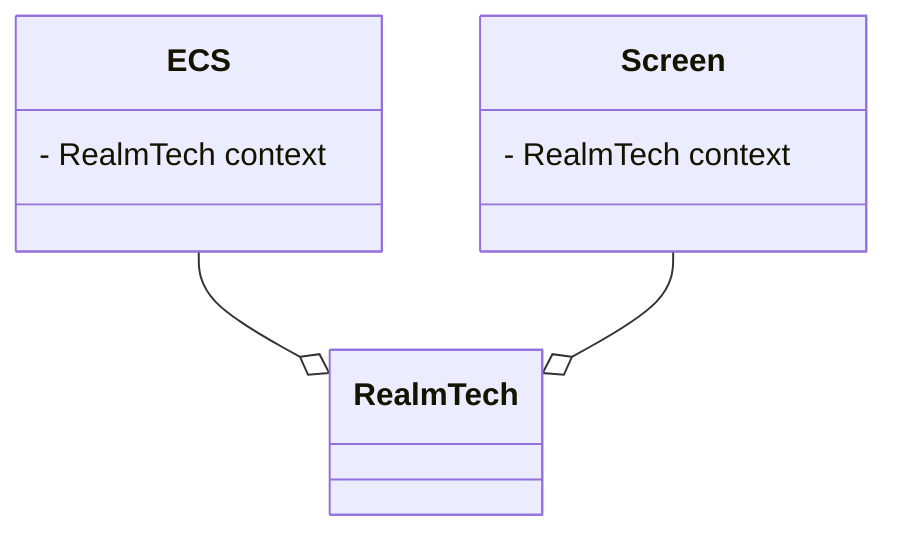
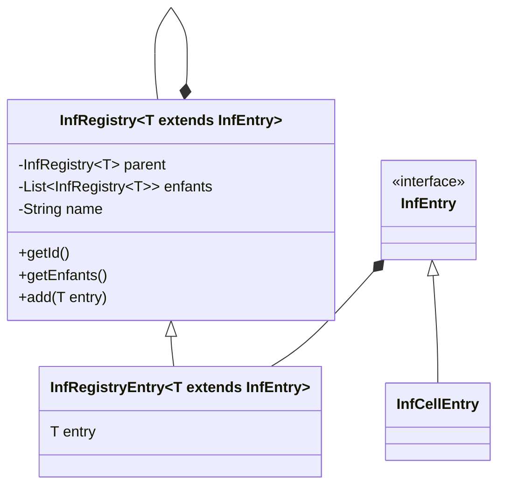

# RealmTech

## Introduction

Un petit jeu qui s'inspire de Factorio (dans la partie 2d de la carte)
et de Gregtech (pour la ménanique de progression des tier). L'un
des buts premiers RealmTech est de changer la mécanique de progression
de Factorio pour qu'elle soit moins dans la production massive
de fiole, mais dans l'évolution progressive des matériaux pour accéder
à de meilleures machines. L'un des buts est aussi de pouvoir avoir
une plus grande liberté de construction avec des blocs décoratifs
qu'on peut posse n'importe où pour créer ses propres bâtiments.

## Joueur au jeu
### cmd
```shell
git clone https://github.com/FabienChatton/realmTech
cd realmTech
.\gradlew desktop:run
```
Cette méthode stock le fichier RealmTechData dans le dossier assets ce
qui n'est pas le comportement attendu. Pour la meilleure configuration,
jeu vous recommande la méthode d'importation de la configuration
dans le dossier.run avec Intellij
### IntelliJ
```shell
git clone https://github.com/FabienChatton/realmTech
```
Et importé la configuration dans le dossier .run

## Road Map

### indev

1. [x] sauvegarder carte générée
2. [x] carte générée procéduralement
3. [x] texture joueur animé
4. [x] inventaire joueur
5. [x] outils
6. [x] récupérer resources avec outils
7. [x] system de craft
8. [x] generation des minerais
9. [ ] machine basique

### infdev

1. [x] carte infinie
2. [ ] cycle jour, nuit
3. [ ] spawn enemies

### alpha

1. [ ] raccourcie clavier custom
2. [ ] machine multi cellules
3. [ ] refonte machine tier (vapeur, lv, mv...)
4. [ ] infrastructure, convoyer/pipe

### beta 

1. [ ] pétrole
2. [ ] véhicule
3. [ ] trains
4. [ ] plusieurs dimensions

## Doc Architecture
RealmTech est la classe la plus haute dans la hiérarchie.
Son rôle est de faire le lien entre les écrans et le jeu. RealmTech,
Permet de donner du context aux écrans.
Par exemple, dans l'écran de sélection de sauvegarde, l'écran
demande au context, quelque sont les sauvegardes à afficher.


Le ECS est la partie centrale du jeu. C'est lui qui contient tout
le nécessaire pour le jeu. Il est créé quand le jeu commence, quand
l'écran va sur le jeu et se termine quand le jeu est fini lorsque le
joueur à quitter la partie. L'ECS contient :
- le système entités composant
- le monde physique
- le joueur
- la sauvegarde

### cellules
Les cellules composent le monde. Elles sont divisées en plusieurs catégories
en fonction de leur layer. Le layer représente le niveau où la cellule
se trouve.

0. ground
1. gournd deco
2. build
3. build déco

Ce système de layer, peut varier dans les futures versions du protocole
de sauvegarde du monde, mais pour le moment, ça marche comme ça.
Le layer est sauvegardé dans le CelleBehavior.
Le layer est utilisé pour poser la cellule sur le plateau


### Registre
Les registres permettent de stocker tout le contenu que jeux va utiliser.
Ainsi, il est plus facile d'ajouter du contenu.


## Inventaire
Les inventaires permettent de stocker des items.
Les inventaires sont un tableau de deux dimensions, représentant dans la
première dimension, l'index de l'inventaire, et dans la deuxième,
le nombre d'item (pas encore implémenté). L'inventaire peut être lié
à un system de craft pour qu'il puisse réaliser les crafts possibles.

## RealmTechData
Le dossier RealmTechData contient les informations nécessaires pour
l'exécution du jeu. Le dossier est créé lors de la première execution
du jeu. Le dossier est sauvegardé, dans le cas du jeu distribué,
au même niveau que le jar, sinon à la racine du repo.
Comme données que contient le dossier, il y a le
fichier de configuration ou les sauvegarde des mondes.
### Hiérarchie du dossier
```text
|-- RealmTechData
    |-- saves
    |   |-- $sauvegarde 1
    |   |-- $sauvegarde 2
    |   |-- $sauvegarde 3
    |   ...
    |-- properties
        |-- options.cfg
```

## Protocole de sauvegarde de RealmTech
### version 7

Le layer d'une cellule représente sa position dans la hauteur. C'est la
cellule avec le plus grand layer qui sera affiché. Le layer ne peut
pas être négatif.

0. ground
1. ground deco
2. build
3. build deco

### Hiérarchie dossier
```text
|-- $nomDeLaSauvegarde
    |-- level
        |-- header.rsh
        |-- chunks
            |-- 0,0.rsc
            |-- 0,1.rsc
            |-- 1,0.rsc
            |-- ...  
```
#### Fichier header.rsh
Ce fichier contient des métadonnées sur le monde.
```text
"RealmTech", String
taille nom sauvegarde, byte
nomSauvegade, bytes len n
Version protocole file save, int
save date, long
seed, long
player position x, float
player position y, float
```
#### Fichier .rsc
Le nom du fichier qui correspond à un fichier .rsc, correspond à la position
du chunk en jeu. Le nom du fichier contient la position X du chunk, un "," et
La position Y du chunk. 12,23.rsc. Chaque fichier contient un petit header pour
specifier la version du protocole de sauvegarde. Le header contient aussi
un "tableau associatif" entre hash (int) et id (byte) des entrées des registres
des celles pour éviter de les hash soit pour chaque cellule dans le fichier.
```text
Métadonnées
    - version du protocole, int
Header
    - nombre de cellule que contient le chunk, short
Body
    pour chaque cellule :
        - hash du cellRegisterEntry mini, byte
        - position dans le chunk, byte
```
Pour récupérer le hash du registre pour la cellule qui est un int,
il faut cast le int en byte, cella va faire des overflow et c'est
tout à fait normal.

