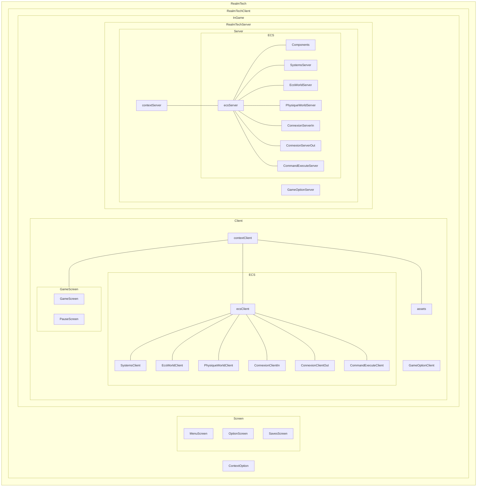
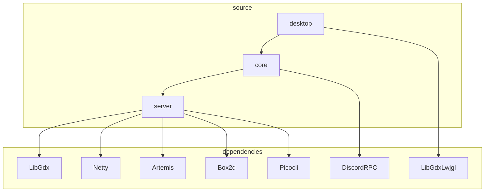
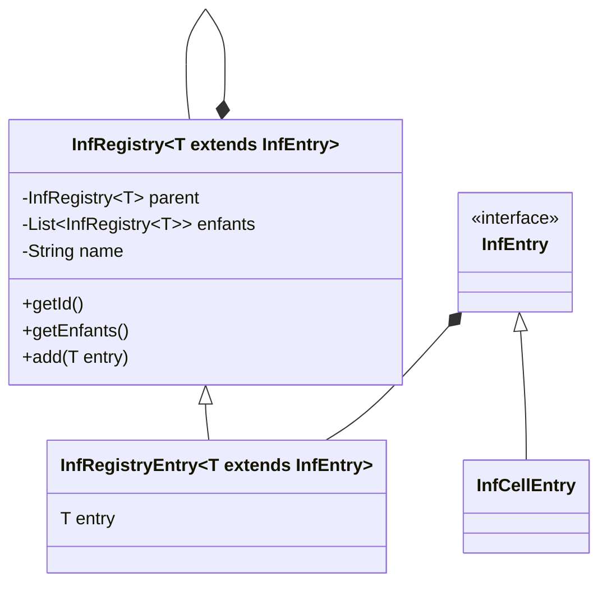
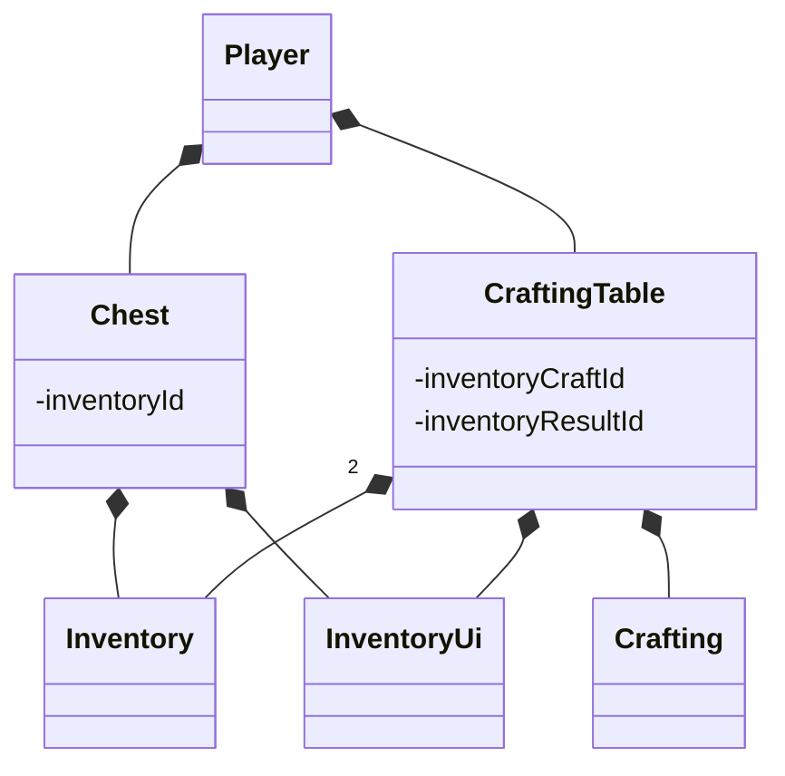

# RealmTech

## Introduction

Un petit jeu qui s'inspire de Factorio (dans la partie 2d de la carte)
et de Gregtech (pour la mécanique de progression des tiers). L'un
des buts premiers RealmTech est de changer la mécanique de progression
de Factorio pour qu'elle soit moins dans la production massive, 
mais dans l'évolution progressive des matériaux pour accéder
à de meilleures machines.L'un des buts est aussi de pouvoir avoir
une plus grande liberté de construction avec des blocs décoratifs
pour créer ses propres bâtiments.

## Jouer au jeu
### cmd
```shell
git clone https://github.com/FabienChatton/RealmTech
cd RealmTech
.\gradlew desktop:run
```
Attention, cette méthode stock le fichier RealmTechData dans le dossier assets, ce qui n'est pas le comportement attendu. Pour un lancement optimal, il est recommandé d'utiliser la méthode avec IntelliJ.
### IntelliJ
```shell
git clone https://github.com/FabienChatton/RealmTech
```
Il faut ensuite importer la configuration dans le dossier .run

### Docker (Server Only)

Pour avoir un serveur dedié. <s>Il existe une image sur docker hub qui peut être utilisé pour lancer un serveur.</s> Pour build l'image du serveur manuellement, il faut faire la commande de build qui va créer l'image realmtech-server, il est également possible de changer les build-arg pour spécifier le port, nom de sauvegarde et seed
du monde.

Pour lancer l'image docker, il suffit de faire la commande docker run ci-dessous. Vous pouvez également changer les arguments d'environnement pour le port, nom de sauvegarde et seed du monde (la seed 0 signifie aléatoire). Attention a bien spécifier l'emplacement de stockage du dossier RealmTechData, car c'est lui qui contient toute la sauvegarde du serveur.

```sh
docker build -t realmtech-server --build-arg port=25533 --build-arg savename=myworld --build-arg seed=0 -f Dockerfile .

docker run -d -p 25533:25533 -v ./RealmTechData/:/app/RealmTechData -e PORT=25533 -e SAVENAME=myworld -e SEED=0 --name realmtech-server realmtech-server
 ```

## Road Map

### indev

1. [x] Sauvegarde de la carte générée
2. [x] Génération de cartes procédurale
3. [x] Animation du joueur
4. [x] Inventaire du joueur
5. [x] Outils
6. [x] Récupération de ressource avec outils
7. [x] Système de craft
8. [x] Génération de minerais
9. [x] Machine basique

### infdev

1. [x] Carte infinie
2. [x] Serveur interne
3. [x] Console de debug

### alpha

1. [x] Cycle jour/nuit
2. [ ] Machine électrique
3. [ ] Infrastructure, convoyeur/pipe
4. [ ] Machine multi-cellules
5. [ ] Raccourci clavier

### beta 

1. [ ] Pétrole
2. [ ] Véhicule
3. [ ] Trains
4. [ ] Dimensions

## Documentation Architecture
RealmTech est la globalité du projet. La partie client est en soi, le jeu vu par le joueur. La partie serveur contient le serveur de jeu. Pour que le jeu fonctionne, il est nécessaire d'avoir une partie client et une partie serveur. Cependant, pas d'inquiétude : le client inclut également le serveur. De plus, le serveur peut être utilisé de manière "Standalone", c'est-à-dire sans le client. Ainsi, des clients peuvent se connecter à un serveur hébergé sur une machine dédiée.


L'ECS est la partie centrale du jeu. C'est lui qui contient tout
le nécessaire au bon fonctionnement. Il est créé lors du lancement et s'éteint lors de la fermeture lorsque le joueur quitte la partie.
L'ECS contient :
- Système entités composant
- Monde physique
- Joueur
- Sauvegarde

### Organisation des projets
RealmTech est composé de 3 sous projets
- core
- server
- desktop

Le core est la partie comprenant le code pour la partie client, c'est ici
qu'on trouve tout ce qui est texture ou interface graphique.

Le server est la partie... serveur, il contient tout le code qui permet l'interaction entre le client et le serveur.
C'est ce sous-projet qui est le plus gros du code.

Le desktop ne comporte que la class main pour lancer le jeu sur pc.

Il y a le sous-projet test, mais il n'est utilisé que pour faire des tests unitaires.




### Cellules
Les cellules composent le monde. Elles sont divisées en plusieurs catégories, en fonction de leur layer. Le layer représente le niveau où la cellule se trouve.

0. ground
1. ground deco
2. build
3. build déco

Ce système de layer, peut varier dans les futures versions du protocole
de sauvegarde du monde, mais pour le moment, il fonctionne comme sa.
Le layer est sauvegardé dans le CelleBehavior.
Le layer est utilisé pour poser la cellule sur le plateau


### Registre
Les registres permettent de stocker tout le contenu que le jeu va utiliser.
Ainsi, il est plus facile d'ajouter du contenu.


## Inventaire
Les inventaires permettent de stocker des items.
Les inventaires sont un tableau de deux dimensions, représentant dans la
première dimension, l'index de l'inventaire, et dans la deuxième,
le nombre d'item. L'inventaire peut être lié
à un system de craft.
### Protocole de sauvegarde inventaire
La version du protocole de sauvegarde sont les premiers 4 octets de l'inventaire
sérialisé.
```text
Métadonnées
    - version du protocole, int
    - nombre de row, int
    - nombre de slot par row, int
    - backgoundTextureName, String (US_ASCII)
 body
    pour chaque slot:
        - hash du registre de l'item, int
        - le nombre d'item, byte
```
Les rows sont les lignes, c'est-à-dire qu'elles vont de gauche à droite, alors
que les slot par row sont les colonnes, c'est-à-dire de haut en bas
```text
+-+-+ 
| | | <- row
+-+-+
| | |
+-+-+
 /\ 
 || slot par row
```
Un composant d'inventaire seul, n'est pas utile, il doit être utilisé avec un autre composant, comme un composant de coffre, ou un composant de table de craft




## RealmTechData
Le dossier RealmTechData contient les informations nécessaires à
l'exécution du jeu. Le dossier est créé lors de la première execution
du jeu. Le dossier est sauvegardé au meme emplacement que le jar ou a la racine du repo.
Le dossier contient les fichiers de configurations et les sauvegardes des mondes.

### Hiérarchie du dossier
```text
|-- RealmTechData
    |-- saves
    |   |-- $sauvegarde 1
    |   |-- $sauvegarde 2
    |   |-- $sauvegarde 3
    |   ...
    |-- properties
        |-- options.cfg
```

## Protocole de sauvegarde de RealmTech
### Version 9

Le layer d'une cellule représente sa position dans la hauteur. C'est la
cellule avec le plus grand layer qui sera affiché. Le layer ne peut
pas être négatif.

0. ground
1. ground deco
2. build
3. build deco

### Hiérarchie dossier
```text
|-- $nomDeLaSauvegarde
    |-- playerInventory.psi
    |-- level
    |   |-- header.rsh
    |   |-- chunks
    |       |-- 0,0.rsc
    |       |-- 0,1.rsc
    |       |-- 1,0.rsc
    |       |-- ...  
    |-- players
        |-- [uuid]
            |-- inventory.pis
```
#### Fichier header.rsh
Ce fichier contient des métadonnées sur le monde.
```text
nomSauvegade, bytes len n + '\n'
seed, long
```
#### Fichier .rsc
Un fichier .rsc contient les données d'un chunk. Le fichier est nommée en
fonction du <code>chunk pos</code> du chunk. Les deux coordonnées sont
séparés par une virgule, par exemple : 12,-34.rsc.
```text
- nombre de cellule que contient le chunk, short
pour chaque cellule :
    - hash du cellRegisterEntry, int
    - position dans le chunk, byte
```
Un chunk fait <code>version protocole (int) + nombre de cells (short) * taille cell (5 bytes) + chunkPosX (int) + chunkPosY (int)</code>.

Une cellule fait <code>5 bytes</code>.
#### Fichier .psi

Le fichier de sauvegarde de l’inventaire d'un joueur.
Il utilise le serializer du coffre pour sauvegarder l'inventaire
du joueur.
