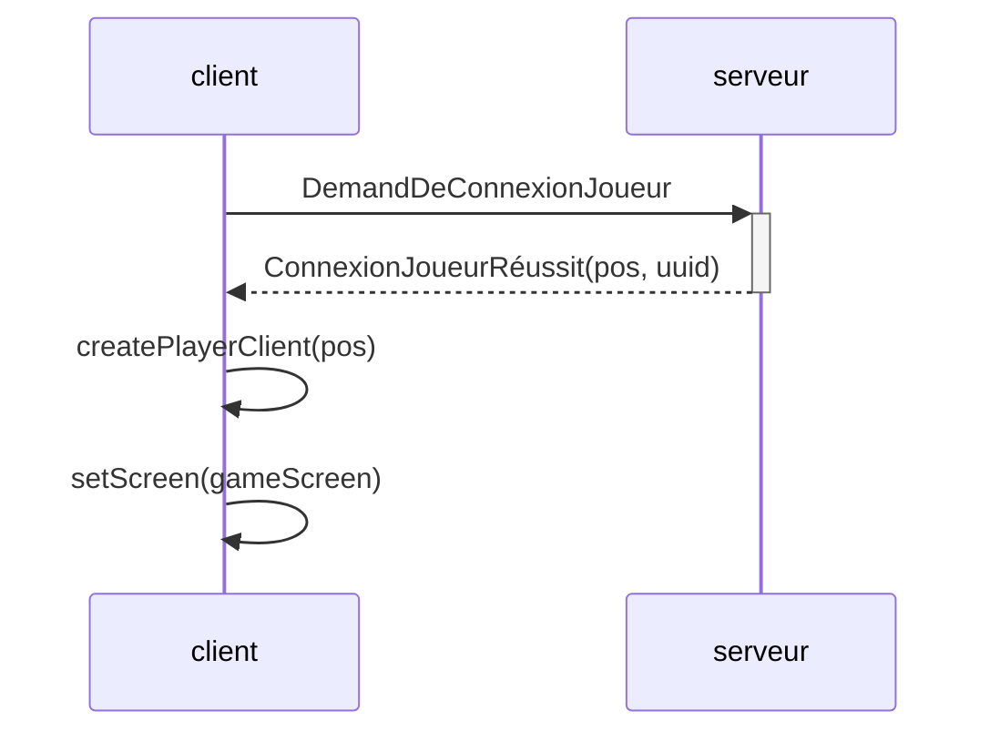

```mermaid
sequenceDiagram
    participant client
    participant serveur

    client ->>+ serveur: DemandDeConnexionJoueur
    serveur -->>- client: ConnexionJoueurRéussit(pos, uuid)
    client ->> client: createPlayerClient(pos)
    client ->> client: setScreen(gameScreen)
```