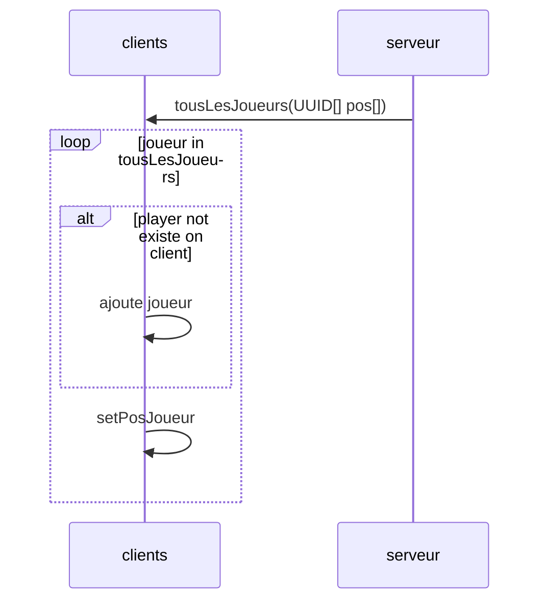

```mermaid
sequenceDiagram
    participant clients
    participant serveur
    
    serveur ->> clients: tousLesJoueurs(UUID[] pos[])
    loop joueur in tousLesJoueurs
        alt player not existe on client
            clients ->> clients: ajoute joueur
        end
        clients ->> clients: setPosJoueur
    end
```