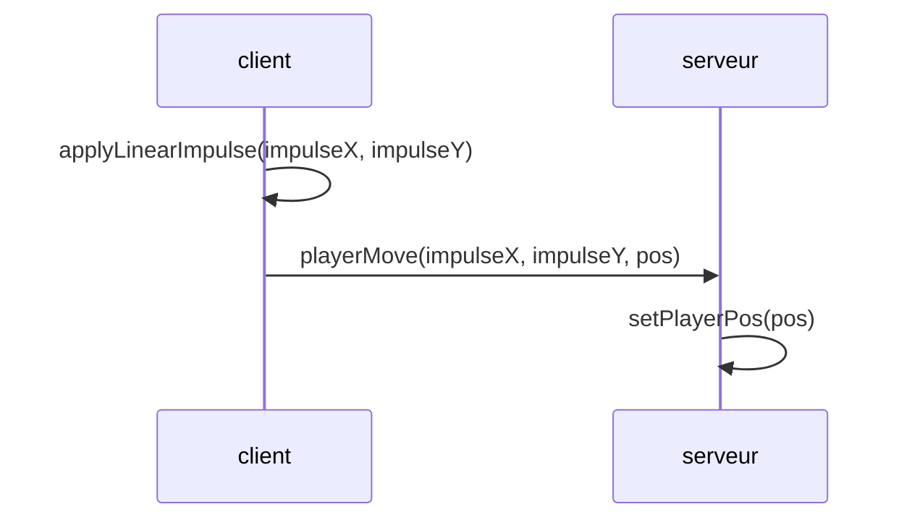

bonjour 

```mermaid
sequenceDiagram
    participant client
    participant serveur
    
    client ->> client: applyLinearImpulse(impulseX, impulseY)
    client ->> serveur: playerMove(impulseX, impulseY, pos)
    serveur ->> serveur: setPlayerPos(pos)
```